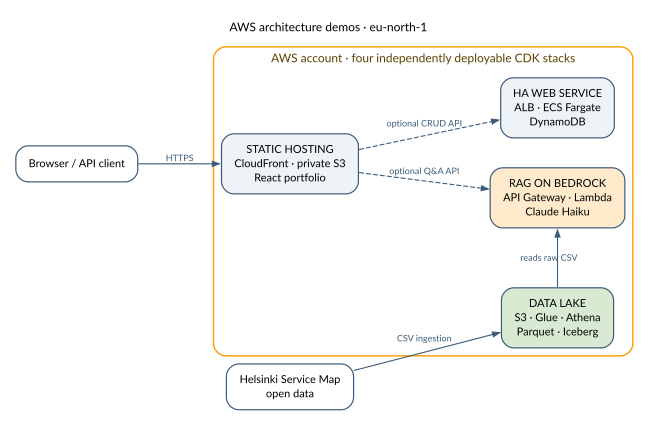

# aws-projects

[](https://github.com/jussiohag/aws-projects/actions/workflows/ci.yml)
[](LICENSE)

AWS architecture demos built with CDK (Python). Each project demonstrates a production-ready pattern deployed to `eu-north-1` (Stockholm).

**[Open the deployed architecture portfolio](https://d1bccyxq5pc9x6.cloudfront.net)**

## Projects

| Project | Services | Description |
|---------|----------|-------------|
| [Data Lake](projects/data-lake/) | S3, Glue, Athena, Iceberg | Helsinki open data pipeline with CSV → Parquet → Iceberg evolution |
| [HA Web Service](projects/ha-web-service/) | VPC, ALB, Fargate, DynamoDB | Two-AZ Fargate service with no NAT Gateway architecture |
| [RAG on Bedrock](projects/rag-bedrock/) | Lambda, API Gateway, Bedrock | Q&A over Helsinki data using Claude Haiku |
| [Static Hosting](projects/static-hosting/) | S3, CloudFront | React frontend for the other three projects, served from S3 behind CloudFront with origin access control |

## Architecture Overview



See [docs/architecture.md](docs/architecture.md) for deployment diagrams, data flows, trust boundaries, and design tradeoffs.

## Quick Start

### Prerequisites

- AWS CLI v2 configured with `eu-north-1`
- AWS CDK v2 (`npm install -g aws-cdk`)
- Python 3.12+
- Docker (for Fargate project)

### Deploy a project

```bash
cd projects/<project-name>/cdk
python3 -m venv .venv && source .venv/bin/activate
pip install -r requirements.txt
cdk deploy
```

### Tear down

```bash
cdk destroy   # per project
```

## Project Structure

```
aws-projects/
├── projects/
│   ├── data-lake/
│   │   ├── cdk/              CDK stack (S3, Glue, Athena)
│   │   ├── queries/          Athena SQL (raw, Parquet, Iceberg)
│   │   └── scripts/          Data download + Helsinki CSV
│   ├── ha-web-service/
│   │   ├── cdk/              CDK stack (VPC, ALB, Fargate, DynamoDB)
│   │   └── app/              FastAPI container + Dockerfile
│   ├── rag-bedrock/
│   │   ├── cdk/              CDK stack (Lambda, API Gateway, IAM)
│   │   └── lambda/           Python handler (S3 retrieval + Bedrock)
│   └── static-hosting/
│       ├── cdk/              CDK stack (S3, CloudFront, bucket deployment)
│       └── src/              React + TypeScript frontend (Vite)
├── docs/
│   ├── architecture.md       Detailed architecture documentation
│   └── diagrams/             Graphviz sources and rendered SVG diagrams
└── private/                  .gitignored — credentials, interview prep
```

## Tech Stack

- **IaC**: AWS CDK v2 (Python)
- **Compute**: ECS Fargate (256 CPU / 512 MB), Lambda
- **Storage**: S3, DynamoDB (on-demand)
- **Analytics**: Glue Data Catalog, Athena, Apache Iceberg
- **AI/ML**: Amazon Bedrock (Claude Haiku 4.5)
- **Networking**: VPC (2 AZ), ALB, API Gateway, VPC Gateway + Interface Endpoints
- **Frontend**: React 19, TypeScript, Vite, Vitest
- **CDN**: CloudFront with origin access control
- **Application**: FastAPI, uvicorn, boto3

## Cost

The live demo's RAG chat is intentionally offline: enabling it would bake the API key into the public JS bundle, exposing a paid Bedrock endpoint. The frontend shows a graceful "not configured" message instead; deploy the rag-bedrock stack and rebuild with `VITE_RAG_API_URL`/`VITE_RAG_API_KEY` to run it privately.

All four projects run under $2/day combined. The RAG project has zero idle cost (Lambda + API Gateway are pay-per-request; Bedrock is pay-per-token), and static hosting is close to free at portfolio traffic since CloudFront and S3 both bill per request. The main running costs are the ALB (~$0.50/day) and VPC interface endpoints (~$0.24/day each). Destroy stacks when not in use.

## License

MIT — see [LICENSE](LICENSE).
