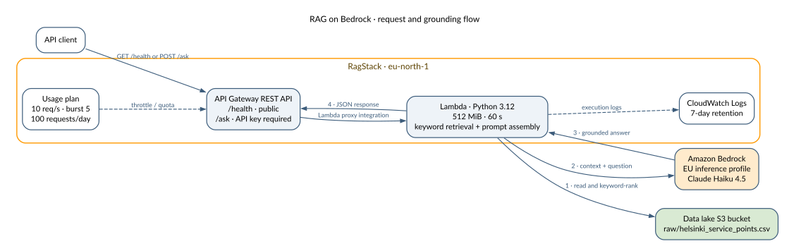
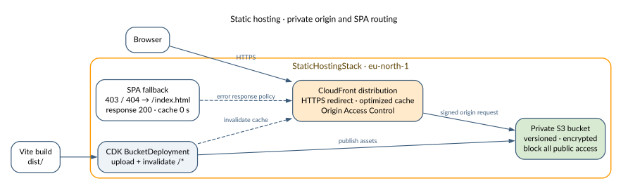

# Architecture

Four independently deployable AWS CDK stacks demonstrate storage, analytics, application, AI, and edge-delivery patterns in `eu-north-1` (Stockholm).


The stacks share an account and tagging scheme, but they are not one deployment unit. Only one runtime dependency crosses stack boundaries: RAG on Bedrock reads the raw Helsinki dataset from the data lake bucket. The static frontend can call the two APIs when their URLs are supplied at build time.

## Data lake


The data bucket holds three representations of the same dataset:

| Prefix | Format | Purpose |
|---|---|---|
| `raw/` | CSV | Immutable landing data and crawler input |
| `curated/` | Parquet | Columnar analytics with lower scan cost |
| `iceberg/` | Apache Iceberg | Row-level changes, snapshots, and time travel |

The Glue crawler reads only `raw/` and registers its schema in `helsinki_open_data`. Athena uses that catalog for queries, writes CTAS and Iceberg data back to the data bucket, and sends query output to a separate results bucket. The enforced 1 GiB per-query cutoff limits accidental scans.

The measured demo query scanned 3,764,820 bytes as CSV and 39,707 bytes as Parquet: about 99% less data scanned. At demo scale, storage and query charges are negligible; the pattern matters as data volume grows.

## HA web service


The internet-facing ALB occupies public subnets. Two FastAPI tasks run in private subnets and are spread across two Availability Zones. The target group checks `/health`; ECS maintains the desired count and rolls back failed deployments through its circuit breaker.

There is no NAT Gateway. Private tasks reach only the AWS services needed by the workload:

| Endpoint type | Services | Role |
|---|---|---|
| Gateway | DynamoDB, S3 | Application data and ECR image layers |
| Interface | ECR API, ECR Docker, CloudWatch Logs | Image discovery, image pull, and logging |

DynamoDB uses on-demand billing and point-in-time recovery. The application task role receives access to this table only; the execution role handles image pulls and logs. A workload that calls arbitrary public or third-party endpoints would still need controlled egress, such as NAT or a proxy.

## RAG on Bedrock



`GET /health` is public. `POST /ask` requires an API key and is governed by a usage plan with a 10 requests/second rate, burst capacity of 5, and a quota of 100 requests per day.

For each question, Lambda reads the raw Helsinki CSV, ranks records with keyword matching, builds a grounded prompt, and invokes Claude Haiku 4.5 through an EU Bedrock inference profile. This intentionally avoids a continuously billed vector store. Keyword retrieval is inexpensive and transparent, but it does not provide semantic matching; a production path would introduce embeddings, a vector index or Bedrock Knowledge Base, and guardrails.

The function is configured with 512 MiB memory, a 60-second timeout, least-privilege access to the source bucket and model, and a dedicated log group with seven-day retention.

## Static hosting



The [deployed frontend](https://d1bccyxq5pc9x6.cloudfront.net) is a React single-page application built with Vite. CDK uploads `dist/` to a private, encrypted, versioned S3 bucket and invalidates the CloudFront distribution. Origin Access Control is the only read path to the bucket, and viewer requests are redirected to HTTPS.

CloudFront maps S3 `403` and `404` responses to `/index.html` with a `200` response and a zero-second error-cache TTL. This lets direct navigation and refreshes work for client-side routes such as `/data-lake` and `/rag-bedrock`.

The API integrations are optional build-time configuration. A public bundle must not contain a paid RAG API key; the deployed portfolio therefore leaves live chat disabled unless it is rebuilt for controlled use.

## Shared operating model

All resources carry `Project`, `Owner`, and `Environment` tags for inventory and cost allocation. Demo data resources use `RemovalPolicy.DESTROY` and automatic cleanup so teardown is predictable. Production deployments should retain or back up stateful resources instead.

The architecture sources live beside the rendered assets in [`docs/diagrams/`](diagrams/). Regenerate an SVG after changing its Graphviz source:

```bash
dot -Tsvg docs/diagrams/<name>.dot -o docs/diagrams/<name>.svg
```
