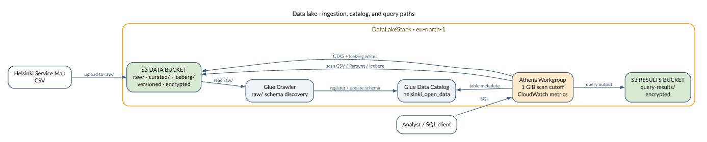

# Data Lake — Helsinki Open Data

A serverless data lake built on Helsinki's public service map data. Demonstrates the full analytics evolution: raw CSV ingestion → columnar Parquet conversion → Apache Iceberg for ACID transactions and time travel.

## Architecture



See the [architecture guide](../../docs/architecture.md#data-lake) for data flows, boundaries, and design tradeoffs.

## What It Demonstrates

### CSV → Parquet: 99% Cost Reduction

Athena charges $5 per TB scanned. Converting raw CSV to Parquet with columnar storage:

| Format | Bytes Scanned | Cost at Scale |
|--------|---------------|---------------|
| Raw CSV | 3,764,820 | $5.00/TB |
| Parquet | 39,707 | $0.05/TB |

Same query, same results, **99% less data scanned**.

### Apache Iceberg: ACID on S3

Traditional Hive tables on S3 are append-only. Iceberg adds:

- **UPDATE/DELETE**: Modify individual rows without rewriting entire partitions
- **Time travel**: Query data as it existed at any point in time
- **Schema evolution**: Add/rename/drop columns without rewriting data
- **Snapshot isolation**: Concurrent readers and writers without conflicts

```sql
-- Update a row (impossible with plain Hive/Parquet)
UPDATE services_iceberg SET name_en = 'New Name' WHERE id = 51342;

-- Time travel: see the value before the update
SELECT name_en FROM services_iceberg
FOR TIMESTAMP AS OF TIMESTAMP '2026-06-15 14:03:14 UTC'
WHERE id = 51342;
```

This is the foundation of what AWS S3 Tables manages at scale — Iceberg as a native S3 storage format.

## Data Source

**Helsinki Service Map** (`hel.fi/palvelukarttaws`): 21,498 service points covering libraries, schools, healthcare, parks, and cultural venues across the Helsinki metropolitan area.

Fields: `id`, `name_fi`, `name_en`, `street_address_fi`, `address_zip`, `municipality`, `provider_type`, `latitude`, `longitude`, `www_fi`, `phone`

## Deploy

```bash
cd cdk
python3 -m venv .venv && source .venv/bin/activate
pip install -r requirements.txt
cdk deploy
```

## Run Queries

After deploying, upload data and run the crawler:

```bash
aws s3 cp scripts/helsinki_service_points.csv \
  s3://helsinki-data-lake-<ACCOUNT_ID>/raw/helsinki_service_points.csv

aws glue start-crawler --name helsinki-raw-crawler
```

Then run queries from `queries/` in order (01 through 08) using the `helsinki-data-lake` workgroup in the Athena console, or via CLI:

```bash
aws athena start-query-execution \
  --query-string "$(cat queries/01_explore_raw.sql)" \
  --work-group helsinki-data-lake
```

## Resources Created

| Resource | Name | Cost |
|----------|------|------|
| S3 Bucket (data) | `helsinki-data-lake-<ACCOUNT>` | ~$0.01/mo |
| S3 Bucket (results) | `helsinki-data-lake-results-<ACCOUNT>` | ~$0.01/mo |
| Glue Database | `helsinki_open_data` | Free |
| Glue Crawler | `helsinki-raw-crawler` | ~$0.01/run |
| Athena Workgroup | `helsinki-data-lake` | $5/TB scanned |

## Tear Down

```bash
cdk destroy
```
