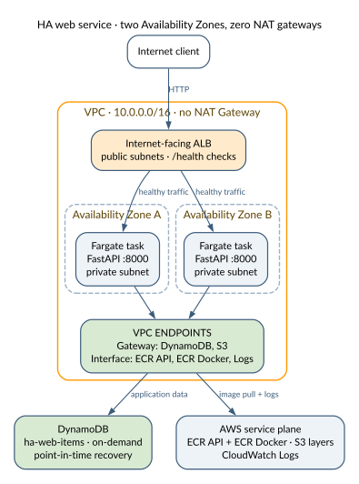

# HA Web Service — Fargate + DynamoDB

A highly available REST API running on ECS Fargate behind an Application Load Balancer, with DynamoDB as the data store. The key design decision: **no NAT Gateway**, using VPC endpoints instead.

## Architecture



See the [architecture guide](../../docs/architecture.md#ha-web-service) for network paths, boundaries, and design tradeoffs.

## What It Demonstrates

### No NAT Gateway Architecture

NAT Gateways cost ~$32/month per AZ ($64/month for 2 AZs) plus data processing charges. This architecture eliminates them entirely:

| Traffic | Path | Cost |
|---------|------|------|
| DynamoDB | Gateway VPC Endpoint | Free |
| S3 (ECR layers) | Gateway VPC Endpoint | Free |
| ECR API | Interface VPC Endpoint | ~$7/mo |
| CloudWatch Logs | Interface VPC Endpoint | ~$7/mo |

**Net savings**: ~$50/month compared to NAT Gateway, while being **more secure** — Fargate tasks have zero internet access. All AWS service traffic stays on the AWS backbone.

### High Availability

- **2 Fargate tasks** across 2 Availability Zones
- **ALB health checks** on `/health` every 30 seconds
- **Circuit breaker** with automatic rollback on failed deployments
- **Self-healing**: kill a task, ECS replaces it in ~30 seconds

### Least-Privilege IAM

- **Task execution role**: pulls images from ECR, writes to CloudWatch Logs
- **Task role**: read/write to the specific DynamoDB table ARN only
- Roles are separate — execution role cannot touch application data

## API

| Method | Path | Description |
|--------|------|-------------|
| GET | `/health` | Health check |
| GET | `/items` | List items (limit 100) |
| GET | `/items/{id}` | Get item by ID |
| POST | `/items` | Create item |
| PUT | `/items/{id}` | Update item |
| DELETE | `/items/{id}` | Delete item |

### Example

```bash
ALB="http://<alb-dns-name>"

# Health check
curl $ALB/health

# Create
curl -X POST $ALB/items \
  -H "Content-Type: application/json" \
  -d '{"name":"Oodi Library","description":"Helsinki Central Library","category":"library"}'

# List
curl $ALB/items
```

## Deploy

```bash
cd cdk
python3 -m venv .venv && source .venv/bin/activate
pip install -r requirements.txt
cdk deploy
```

The first deploy builds the Docker image locally and pushes it to ECR (~3-5 minutes).

## Resources Created

| Resource | Cost |
|----------|------|
| ALB | ~$0.50/day |
| 2x Fargate tasks (256 CPU, 512 MB) | ~$0.24/day |
| DynamoDB (on-demand) | ~$0.01/day |
| VPC Interface Endpoints (3) | ~$0.72/day |
| VPC Gateway Endpoints (2) | Free |

**Total**: ~$1.50/day. Destroy when not in use.

## Tear Down

```bash
cdk destroy
```
